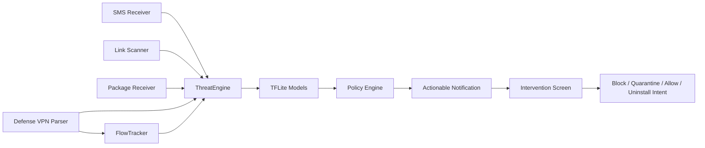

# CyberShield Android

CyberShield Android, Samsung Galaxy A56 gibi orta sinif cihazlarda dusuk pil/RAM yukuyla calismasi hedeflenen, TFLite tabanli otomatik siber savunma uygulamasidir. Uygulama SMS, link, APK kurulumu ve VPN paket kaynaklarindan sinyal toplar; tehdit modellerini olay bazli calistirir; kullanici onayli mudahale ekranlariyla engelleme, karantina, guvenli sayma ve kaldirma akisini yonetir.

## Temel yetenekler

- 14 adet TFLite model uygulama icinde paketlenir ve cihaz uzerinde offline inference yapar.
- Foreground servis ile arka planda otomatik savunma calisir.
- Bildirimler dogrudan ilgili mudahale ekranina gider.
- Mudahale secenekleri: uyar, engelle, 1 saat gecici engelle, karantinaya al, guvenli say, kaldirma sistem ekranina yonlendir.
- SMS/metin, URL, phishing HTML, APK statik sinyal, DNS, DoH, network flow, IoT/IIoT, TLS/session ve post-kuantum anomali alanlari kapsanir.
- Model yukleme olay bazlidir; pil/performans icin ayni anda sicak tutulan model sayisi sinirlanir.
- Blok liste, gecici blok, whitelist ve son karari geri alma politikasi vardir.

## Model envanteri

| Model | Girdi | Dogruluk | Recall | Savunma etkisi |
| --- | ---: | ---: | ---: | --- |
| Android Malware | 9503 | 94.85% | 97.07% | APK kurulum/degisimlerinde zararli yazilim riskini hesaplar; karantina ve kaldirma akisini tetikler. |
| Mirai Malware | 64 | 99.63% | 100.00% | Mirai benzeri IoT zararlilarini ve botnet davranislarini ayirt eder. |
| Network Attack | 79 | 95.85% | 98.01% | VPN flow istatistiklerinden ag saldirisi riskini uretir. |
| DNS Attack | 27 | 81.26% | 99.36% | DNS trafiginde saldiri yakalamayi onceliklendirir; yuksek recall nedeniyle uyari/blok politikasi icin uygundur. |
| DoH L1 Detector | 29 | 99.23% | 98.91% | DoH / non-DoH ayrimini yapar ve supheli DoH trafigini L2 modele yollar. |
| Malicious DoH L2 | 29 | 99.90% | 99.91% | DoH icinde zararli davranis olasiligini hesaplar; esik 0.2879624069. |
| Social Engineering Text | 2530 | 97.78% | 96.22% | SMS/metinlerde aciliyet, korku, odul, banka ve kimlik dogrulama baskisini sezgisel sinyale cevirir. |
| Social Engineering URL | 48 | 97.67% | 97.87% | URL yapisi, alan adi, path/query ve phishing kelime sinyallerini analiz eder. |
| Phishing HTML | 40 | 90.62% | 92.20% | Link/HTML form, parola, iframe, script ve mixed-content sinyallerini degerlendirir. |
| IoT/IIoT Attack | 71 | 92.42% | 98.82% | IoT/IIoT akislari icin endpoint izolasyonu ve flow bloklama karari uretir. |
| TLS/Session Anomaly | 32 | 97.34% | 82.73% | TLS/session davranisinda anomali riskini skorlar. |
| Post-Quantum Anomaly | 32 | 84.88% | 98.00% | PQC/TLS session sinyallerinde anomali odakli yuksek yakalama saglar. |
| Post-Quantum Taxonomy | 32 | 83.30% | - | Siniflandirma/aciklama modeli; mudahale yerine olay aciklamasi icin kullanilir. |
| Post-Quantum Subtype | 32 | 81.98% | - | Alt tur aciklamasi uretir; karar mekanizmasini destekler. |

> Skorlar egitim/test veri setleri uzerinden olculmustur. Gercek saha trafiginde esik kalibrasyonu, loglama ve false-positive takibi gereklidir.

## Egitim ve donusturme ozeti

1. CSV/zip kaynaklari domain bazinda ayrildi: Android malware, Mirai, DNS, DoH, phishing, social engineering, network, IoT/IIoT, attack anomaly ve post-kuantum.
2. Veri setleri bellek dostu sekilde okundu; buyuk dosyalarda satir limiti ve parca parca isleme kullanildi.
3. Her domain icin uygun feature uzayi korundu:
   - Android malware: 9503 statik/manifest odakli feature.
   - Network: 79 flow tabanli feature.
   - IoT/IIoT: 71 flow/endpoint feature.
   - DNS/DoH: 27/29 stateful ve heuristik feature.
   - Social engineering: metin icin 2530, URL icin 48 feature.
4. Modeller TFLite formatina cevrildi ve Android runtime uyumlulugu test edildi.
5. Uygulama icinde `model_catalog.json` ile esik, dogruluk, recall, girdi boyutu ve mudahale politikasi merkezi hale getirildi.
6. Telefonda self-test ile 14/14 modelin yuklendigi ve inference calistirdigi dogrulandi.

## Savunma mimarisi



## Mudahale modeli

- Kullanici onayi olmadan yikici islem yapilmaz.
- Uygulama kaldirma Android sistem onayi ile yapilir.
- Domain/IP/port hedefleri blok/whitelist politikasina yazilir.
- Bildirimdeki aksiyonlar olay detayina dogrudan gider.
- VPN izni verildiginde DNS/DoH ve flow analizi TUN paketlerinden beslenir.

## Android uygulama durumu

- Paket adi: `com.monster.cybershield`
- Min SDK: 26
- Target SDK: 35
- TFLite runtime: `org.tensorflow:tensorflow-lite:2.16.1`
- Test cihaz: Samsung Galaxy A56 (`SM_A566B`)
- Son self-test: 14 model OK
- Launcher/adaptive icon eklendi.

## Uretim notu

Tam `0.0.0.0/0` internet forwarding icin native `tun2socks` veya esdeger kullanici-uzayi TCP/IP forwarding katmani gerekir. Mevcut projede TUN okuma, packet parser, flow feature uretimi, model baglantisi ve politika altyapisi hazirdir; tam NAT/forwarding native katmanla tamamlanmalidir.

## Derleme

```powershell
$env:JAVA_HOME='C:\Program Files\Android\Android Studio\jbr'
$env:Path="$env:JAVA_HOME\bin;$env:Path"
gradle assembleRelease
```

Release APK `app/build/outputs/apk/release/app-release.apk` altinda uretilir.
