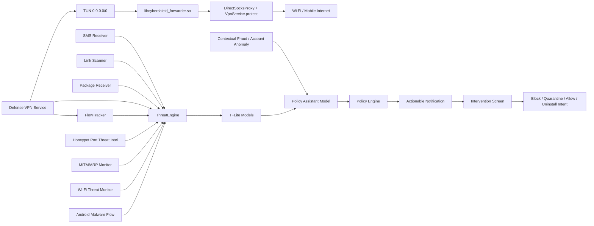

# CyberShield Android

CyberShield Android, Samsung Galaxy A56 gibi orta sinif cihazlarda dusuk pil/RAM yukuyla calismasi hedeflenen, TFLite tabanli otomatik siber savunma uygulamasidir. Uygulama SMS, link, APK kurulumu ve VPN paket kaynaklarindan sinyal toplar; tehdit modellerini olay bazli calistirir; kullanici onayli mudahale ekranlariyla engelleme, karantina, guvenli sayma ve kaldirma akisini yonetir.

## Temel yetenekler

- 20 adet kataloglu TFLite tespit/destek modeli ve ayri CyberShield Policy Assistant modeli uygulama icinde paketlenir; cihaz uzerinde offline inference yapar.
- Foreground servis ile arka planda otomatik savunma calisir.
- Bildirimler dogrudan ilgili mudahale ekranina gider.
- Mudahale secenekleri: uyar, engelle, 1 saat gecici engelle, karantinaya al, guvenli say, kaldirma sistem ekranina yonlendir.
- SMS/metin, URL, phishing HTML, APK statik sinyal, DNS, DoH, network flow, IoT/IIoT, TLS/session ve post-kuantum anomali alanlari kapsanir.
- Wi-Fi MITM / ARP spoofing ve genis Wi-Fi saldiri riski icin gateway/ARP/RSSI/BSSID kontrolu ile TFLite risk skoru birlestirilir.
- CyberShield Policy Assistant modeli, tespit edilen olaya gore profesyonel mudahale onerisi, gerekce, etki ve geri alma bilgisini uretir.
- Model yukleme olay bazlidir; pil/performans icin ayni anda sicak tutulan model sayisi sinirlanir.
- Blok liste, gecici blok, whitelist ve son karari geri alma politikasi vardir.
- arm64-v8a native tun2socks forwarding motoru paketlidir; VPN izni verildiginde `0.0.0.0/0` tam cihaz rotasi acilir ve TCP/UDP trafik yerel SOCKS koprusu uzerinden internete iletilir.
- Supheli Wi-Fi durumunda strict VPN koruma modu devreye girer; VPN izni daha once verildiyse koruma otomatik baslar, bloklu IP/domain/port ve riskli HTTP downgrade akisleri cihaz cikisinda dusurulur.
- DNS leak protection modu aciktir; UDP/TCP 53 istekleri secili tek resolver'a yonlendirilir, bilinen DoH endpointleri strict modda sinirlanir ve Android Private DNS aciksa kullanici uyarilir.
- Network/IoT feature uretimi, yon bazli flow istatistikleri, TCP flag/window, TTL, IAT, active/idle ve payload/header sinyalleriyle CICFlowMeter tarzina yaklastirildi.
- APK feature uretimi, kurulu APK zip yapisi, dex/native lib/asset/suspicious entry sayilari ve sinirli statik string sinyalleriyle genisletildi.
- Model esikleri saha/lab testlerinden sonra `CalibrationActivity` ile kalici olarak kalibre edilebilir.

## Model envanteri

| Model | Girdi | Dogruluk | Recall | Savunma etkisi |
| --- | ---: | ---: | ---: | --- |
| Android Malware | 9503 | 94.85% | 97.07% | APK kurulum/degisimlerinde zararli yazilim riskini hesaplar; karantina ve kaldirma akisini tetikler. |
| Android Malware Flow | 80 | 52.08%* | 99.02%* | CIC-AndMal2017 Android ag akislarindan yuksek-yakalama destek sinyali uretir; tek basina yikici karar vermez. |
| Honeypot Threat Intelligence | 32 | 98.48%* | 90.01%* | Cowrie/Dionaea/Heralding/Honeytrap/Tanner/Mailoney ve SSH/Telnet/SMB/MSSQL/VNC port istatistiklerinden port-risk destek skoru uretir; tek basina engelleme kaniti degildir. |
| Mirai Malware | 64 | 99.63% | 100.00% | Mirai benzeri IoT zararlilarini ve botnet davranislarini ayirt eder. |
| Network Anomaly Attack | 79 | 89.59% | 92.00% | `anomali/Dataset-Ready` CSV'lerinden egitilen binary model; VPN flow istatistiklerinden DDoS/DoS/SYN flood/port scan/brute force/web saldirisi riskini uretir. |
| DNS Attack | 27 | 81.26% | 99.36% | DNS trafiginde saldiri yakalamayi onceliklendirir; yuksek recall nedeniyle uyari/blok politikasi icin uygundur. |
| DoH L1 Detector | 29 | 99.23% | 98.91% | DoH / non-DoH ayrimini yapar ve supheli DoH trafigini L2 modele yollar. |
| Malicious DoH L2 | 29 | 99.90% | 99.91% | DoH icinde zararli davranis olasiligini hesaplar; esik 0.2879624069. |
| Social Engineering Text | 2530 | 97.78% | 96.22% | SMS/metinlerde aciliyet, korku, odul, banka ve kimlik dogrulama baskisini sezgisel sinyale cevirir. |
| Social Engineering URL | 48 | 97.67% | 97.87% | URL yapisi, alan adi, path/query ve phishing kelime sinyallerini analiz eder. |
| Phishing HTML | 40 | 90.62% | 92.20% | Link/HTML form, parola, iframe, script ve mixed-content sinyallerini degerlendirir. |
| StealthPhisher2025 URL/HTML | 59 | 99.90% | 99.86% | Modern phishing altyapilarini, IPFS/kisa link/Google Sites benzeri barindirma izlerini, URL karmasikligini, form/parola ve HTML sezgisel sinyallerini analiz eder. |
| IoT/IIoT Attack | 71 | 92.42% | 98.82% | IoT/IIoT akislari icin endpoint izolasyonu ve flow bloklama karari uretir. |
| TLS/Session Anomaly | 32 | 97.34% | 82.73% | TLS/session davranisinda anomali riskini skorlar. |
| Post-Quantum Anomaly | 32 | 84.88% | 98.00% | PQC/TLS session sinyallerinde anomali odakli yuksek yakalama saglar. |
| Post-Quantum Taxonomy | 32 | 83.30% | - | Siniflandirma/aciklama modeli; mudahale yerine olay aciklamasi icin kullanilir. |
| Post-Quantum Subtype | 32 | 81.98% | - | Alt tur aciklamasi uretir; karar mekanizmasini destekler. |
| CyberShield Policy Assistant | 16 | - | - | Tehdit tipi, kaynak, risk ve hedef sinyallerinden kullanici onayli mudahale onerisi uretir. |
| Wi-Fi MITM / ARP Spoofing | 32 | 99.81% | 99.79% | Gateway MAC degisimi, IP/MAC cakismasi, ARP tablo dalgalanmasi ve model riskini birlestirir. |
| Wi-Fi Threat Detector | 48 | 100.00%* | 100.00%* | ARP poison/flood, WPA3 SAE/downgrade, Evil Twin, deauth/disassoc, beacon flood, DNS spoofing ve SSL stripping veri setlerinden turetilen Wi-Fi riskini skorlar. |
| Contextual Fraud / Account Anomaly | 120 | 36.29%* | 90.00%* | 110 kolonlu fraud/anomali parquet veri setinden egitilen yuksek-yakalama destek modeli; VPN/proxy/Tor, cihaz anomalisi, hesap ele gecirme ve LLM risk alanlarini policy/asistan sinyaline cevirir. |

> Skorlar egitim/test veri setleri uzerinden olculmustur. Gercek saha trafiginde esik kalibrasyonu, loglama ve false-positive takibi gereklidir.
> MITM/ARP modeli su anda sentetik/heuristic bootstrap veri setiyle egitildi; gercek lab ARP spoofing yakalamalariyla yeniden kalibre edilmesi onerilir.
> Android Malware Flow modeli tum CIC-AndMal2017_raw CSV'lerini okuyarak egitildi; flow uyumlu 2.127 CSV egitime girdi, Drebin/MalDroid/Droidware statik dosyalari rapora alindi ancak VPN flow modeline karistirilmadi. Bu model yuksek recall destek sinyalidir; saha esigi 0.60 olarak baslatilir.
> Honeypot Threat Intelligence modeli 2025-07-07 ile 2025-12-31 arasindaki honeypot zaman serilerinden turetilen risk etiketleri ve sentetik temiz platform trafigiyle egitildi. Bu model threat-intelligence destek katmanidir; ulke/port bilgisi tek basina otomatik engelleme sebebi yapilmaz.
> Wi-Fi Threat Detector skoru veri seti icinde cok yuksektir; Android normal uygulamalari ham 802.11 monitor-mode frame okuyamadigi icin model Android'de SSID/BSSID/RSSI/gateway/ARP/VPN-DNS ipuclariyla uygulanir ve saha esigi 0.65 olarak baslatilir.
> StealthPhisher2025 modelinde ham `URL`, `Domain`, `TLD` stringleri ve dis skor gibi duran `WAPLegitimate/WAPPhishing` alanlari ezberleme/sizinti riskine karsi modele alinmadi; bunlar yerine 59 uretilebilir sayisal ozellik kullanildi.
> Contextual Fraud / Account Anomaly modeli yuksek recall icin ayarlandi ancak precision dusuktur; Android uzerinde dogrudan yikici karar degil, asistan/policy risk destegi olarak kullanilmalidir.

## Egitim ve donusturme ozeti

1. CSV/zip kaynaklari domain bazinda ayrildi: Android malware, Mirai, DNS, DoH, phishing, social engineering, network, IoT/IIoT, attack anomaly ve post-kuantum.
2. Veri setleri bellek dostu sekilde okundu; buyuk dosyalarda satir limiti ve parca parca isleme kullanildi.
3. Her domain icin uygun feature uzayi korundu:
   - Android malware: 9503 statik/manifest odakli feature.
   - Network: 79 flow tabanli feature.
   - IoT/IIoT: 71 flow/endpoint feature.
   - DNS/DoH: 27/29 stateful ve heuristik feature.
   - Social engineering: metin icin 2530, URL icin 48 feature.
4. Modeller TFLite formatina cevrildi ve Android runtime uyumlulugu test edildi.
5. Uygulama icinde `model_catalog.json` ile esik, dogruluk, recall, girdi boyutu ve mudahale politikasi merkezi hale getirildi.
6. Policy Assistant modeli, olay riskini kullaniciya uygulanabilir aksiyon diline ceviren ayri bir TFLite karar katmani olarak eklendi.
7. MITM/ARP modeli, cihaz uzerindeki Wi-Fi gateway ve `/proc/net/arp` sinyallerinden 32 feature ureten hibrit monitor ile baglandi.
8. StealthPhisher2025 modeli 336.749 satirlik dengeli phishing veri setiyle egitildi; esik `0.2478628457` olarak kalibre edildi.
9. Flow feature cikarimi, network ve IoT metadata kolon adlarina gore daha birebir map edilecek sekilde genisletildi.
10. APK statik feature cikarimi, Android PackageInfo disinda APK zip/dex/string sinyallerini de kullanacak sekilde genisletildi.
11. Wi-Fi veri setlerinden 916.777 ornekle 48 feature'li `wifi_threat_detector.tflite` egitildi ve uygulamaya baglandi.
12. CIC-AndMal2017_raw altindaki 2.131 CSV okunarak 80 feature'li `android_malware_flow_detector.tflite` egitildi; yuksek recall destek sinyali olarak VPN flow hattina baglandi.
13. Honeypot port istihbarati verilerinden 32 feature'li `honeypot_threat_intel_detector.tflite` egitildi; SSH/Telnet/SMB/MSSQL/VNC riskini network/IoT/DNS modellerine destek sinyali olarak ekler.
14. `anomali/Dataset-Ready` ag CSV'lerinden 79 feature'li binary `network_attack_detector.tflite` yeniden egitildi; threshold `0.2796932459`, attack precision `96.81%`, attack recall `92.00%`.
15. `anomali` 110 kolonlu fraud/anomali parquet verisinden 120 feature'li `contextual_fraud_anomaly_detector.tflite` egitildi; bu model LLM degil, policy/asistan destek risk skorudur.
16. Telefonda self-test ile 20/20 katalog modelinin yuklendigi ve inference calistirdigi dogrulanmalidir.

## Savunma mimarisi



## Mudahale modeli

- Kullanici onayi olmadan yikici islem yapilmaz.
- Uygulama kaldirma Android sistem onayi ile yapilir.
- Domain/IP/port hedefleri blok/whitelist politikasina yazilir.
- Bildirimdeki aksiyonlar olay detayina dogrudan gider.
- VPN izni verildiginde DNS/DoH ve flow analizi TUN paketlerinden beslenir.
- Android Malware Flow modeli ayni VPN flow istatistiklerinden Android zararlı uygulama ag davranisi icin destek risk skoru uretir.
- Contextual Fraud / Account Anomaly modeli 110 kolonlu fraud/anomali veri setinden gelen VPN/proxy/Tor, cihaz guvenligi, hesap davranisi ve LLM risk alanlarini kullanir; mobil uygulamada dogrudan kullanilabilir kaynak olmadiginda sadece policy/asistan destek skoru olarak paketlenir.
- Native forwarding modunda temiz TCP/UDP akislar internete iletilir; blok listedeki domain/IP/port hedefleri, URL'den normalize edilen domainler ve UDP DNS sorgu adlari yerel SOCKS koprusunde dusurulur.
- Supheli Wi-Fi koruma modunda cleartext HTTP port 80 akislar HTTP downgrade riski olarak engellenir; guvenli liste bu karari geri alabilir.
- DNS leak protection modunda CyberShield tek resolver politikasi uygular. Varsayilan resolver Cloudflare `1.1.1.1`; kurulum ekranindan Quad9, Google veya AdGuard secilebilir.
- MITM/ARP olaylarinda gateway kimligi, ARP tablo tutarliligi ve model risk puani birlikte degerlendirilir; supheli Wi-Fi agi isaretleme, VPN korumasini zorunlu onerme ve gecici blok aksiyonlari desteklenir.
- Wi-Fi Threat Monitor SSID/BSSID, RSSI, guvenlik tipi, gateway MAC, ARP tablo oynakligi ve DNS/HTTP downgrade ipuclarindan 48 feature uretir; Android'in ham 802.11 frame siniri nedeniyle deauth/beacon/Evil Twin sinyalleri sahada dolayli belirtilerle yaklasiklanir.
- Production alarm politikasi, guvenilir resolver/VPN ic adres/Google ve Samsung sistem servislerini kullanici bildirimi olarak yukseltmez. Google Play, Play Protect, Android sistem baglantilari, Samsung Galaxy Store, Samsung account/cloud/update/FOTA alan adlari VPN telemetrisinde false-positive whitelist olarak ele alinir. DoH L1 sadece sessiz kapi modeli olarak calisir; ayni hedef icin kisa surede tekrar eden model sinyalleri tek bildirimde tutulur.

## Online guvenlik guncellemeleri

CyberShield modelleri telefonda rastgele yeniden egitmez. Profesyonel akis, yeni veriyi sunucu/Colab/GitHub Releases tarafinda egitip test etmek ve telefona imzali paket olarak indirmektir.

- Uygulama gunde bir kez arka planda `model_update_manifest.json` kontrol eder.
- Varsayilan politika Wi-Fi uzerinden guncellemedir; dusuk pilde arka plan kontrolu ertelenir.
- Threat intelligence feed'leri zaralli domain/IP, phishing pattern, DoH endpoint ve riskli port sinyallerini gunceller.
- TFLite model, metadata, katalog ve threshold paketleri SHA-256 ve ECDSA imzasi dogrulanmadan aktif edilmez.
- Dosyalar once `staging` alanina iner, dogrulama gecerse atomik olarak `active` alana tasinir.
- Bozuk veya imzasiz model reddedilir; uygulama asset icindeki yerlesik eski modele geri duser.
- Ana ekranda guncelleme durumu gorunur ve manuel `Guvenlik guncellemelerini kontrol et` aksiyonu vardir.
- Guncelleme manifest ve paket semasi `docs/SECURITY_UPDATE_PIPELINE.md` icinde tutulur.

## Android uygulama durumu

- Paket adi: `com.monster.cybershield`
- Min SDK: 26
- Target SDK: 35
- TFLite runtime: `org.tensorflow:tensorflow-lite:2.17.0`
- Test cihaz: Samsung Galaxy A56 (`SM_A566B`)
- Son beklenen self-test: 20 katalog modeli OK
- Launcher/adaptive icon eklendi.

## VPN ve Uretim Notu

`app/src/main/jniLibs/arm64-v8a/libcybershield_forwarder.so` arm64 cihazlar icin paketlenmistir. `DefenseVpnService`, VPN izni verildiginde tam cihaz rotasi (`0.0.0.0/0`) acar, native tun2socks motorunu cache altinda uretilen config ile baslatir ve temiz TCP/UDP akislarini `DirectSocksProxy` uzerinden telefonun gercek Wi-Fi/mobil internetine iletir. Outbound soketler `VpnService.protect()` ile VPN dongusune sokulmaz.

Native kutuphane yuklenemez veya motor baslatilamazsa uygulama telefonu internetsiz birakmamak icin guvenli telemetri rotalarina geri duser. ICMP/ping forwarding desteklenmez; dogrulama TCP/UDP uzerinden yapilir.

Samsung Galaxy A56 testinde:

- `Native VPN forwarding kutuphanesi: true`
- `VPN modu: full_device_forwarding`
- `tun0` aktif
- TCP 443 baglanti testi basarili
- ICMP ping beklenen sekilde basarisiz

## Production hardening ve dogrulama

Release build icin debug keystore kullanimi kaldirildi. Imzalama, ortam degiskenleri veya `~/.android/cybershield-release.properties` dosyasi uzerinden verilen yerel release keystore ile yapilir. R8 minify/resource shrink aktiftir.

Production APK icinde test/laboratuvar ekranlari disaridan acilmaz:

- `SelfTestActivity`
- `AttackSimulationActivity`
- `SourceFieldTestActivity`
- `CalibrationActivity`

Ag guvenligi tarafinda cleartext trafik kapatildi ve `network_security_config.xml` ile yalnizca sistem sertifika deposu guvenilir kabul edildi. Sertifika pinning ve MITM proxy testleri ayri saha dogrulamasi gerektirir.

AMTSO Android malware/phishing guvenli testleri, AV-TEST tarzinda batarya/yavaslama/false-positive olcumleri ve MASA/OWASP bagimsiz inceleme hazirliklari icin ayrintili plan:

- `docs/SECURITY_VALIDATION_PLAN.md`
- `docs/PRODUCTION_HARDENING.md`

Android platform sinirlari gecerlidir: root/MDM/router entegrasyonu olmadan sessiz APK silme, modemden saldirgan cihaz atma, router firewall kurali yazma veya baska fiziksel cihazi karantinaya alma yapilamaz. CyberShield kullanici onayli kaldirma ekrani, VPN/DNS/proxy bloklama, guvenli liste, supheli Wi-Fi isaretleme ve aksiyonlu bildirim mekanizmalariyla calisir.

## Derleme

```powershell
$env:JAVA_HOME='C:\Program Files\Android\Android Studio\jbr'
$env:Path="$env:JAVA_HOME\bin;$env:Path"
gradle assembleRelease
```

Release APK `app/build/outputs/apk/release/app-release.apk` altinda uretilir.
