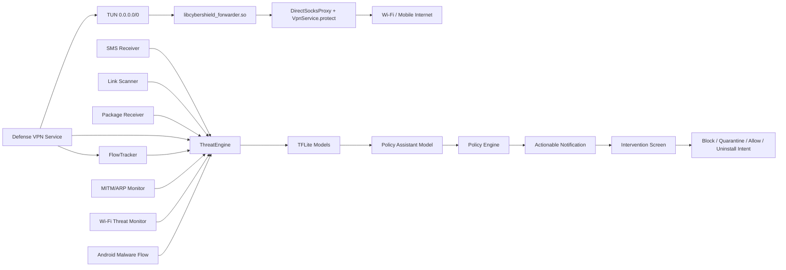

# CyberShield Android

CyberShield Android, Samsung Galaxy A56 gibi orta sinif cihazlarda dusuk pil/RAM yukuyla calismasi hedeflenen, TFLite tabanli otomatik siber savunma uygulamasidir. Uygulama SMS, link, APK kurulumu ve VPN paket kaynaklarindan sinyal toplar; tehdit modellerini olay bazli calistirir; kullanici onayli mudahale ekranlariyla engelleme, karantina, guvenli sayma ve kaldirma akisini yonetir.

## Temel yetenekler

- 19 adet TFLite model uygulama icinde paketlenir ve cihaz uzerinde offline inference yapar.
- Foreground servis ile arka planda otomatik savunma calisir.
- Bildirimler dogrudan ilgili mudahale ekranina gider.
- Mudahale secenekleri: uyar, engelle, 1 saat gecici engelle, karantinaya al, guvenli say, kaldirma sistem ekranina yonlendir.
- SMS/metin, URL, phishing HTML, APK statik sinyal, DNS, DoH, network flow, IoT/IIoT, TLS/session ve post-kuantum anomali alanlari kapsanir.
- Wi-Fi MITM / ARP spoofing ve genis Wi-Fi saldiri riski icin gateway/ARP/RSSI/BSSID kontrolu ile TFLite risk skoru birlestirilir.
- CyberShield Policy Assistant modeli, tespit edilen olaya gore profesyonel mudahale onerisi, gerekce, etki ve geri alma bilgisini uretir.
- Model yukleme olay bazlidir; pil/performans icin ayni anda sicak tutulan model sayisi sinirlanir.
- Blok liste, gecici blok, whitelist ve son karari geri alma politikasi vardir.
- arm64-v8a native tun2socks forwarding motoru paketlidir; VPN izni verildiginde `0.0.0.0/0` tam cihaz rotasi acilir ve TCP/UDP trafik yerel SOCKS koprusu uzerinden internete iletilir.
- Supheli Wi-Fi durumunda strict VPN koruma modu devreye girer; VPN izni daha once verildiyse koruma otomatik baslar, bloklu IP/domain/port ve riskli HTTP downgrade akisleri cihaz cikisinda dusurulur.
- Network/IoT feature uretimi, yon bazli flow istatistikleri, TCP flag/window, TTL, IAT, active/idle ve payload/header sinyalleriyle CICFlowMeter tarzina yaklastirildi.
- APK feature uretimi, kurulu APK zip yapisi, dex/native lib/asset/suspicious entry sayilari ve sinirli statik string sinyalleriyle genisletildi.
- Model esikleri saha/lab testlerinden sonra `CalibrationActivity` ile kalici olarak kalibre edilebilir.

## Model envanteri

| Model | Girdi | Dogruluk | Recall | Savunma etkisi |
| --- | ---: | ---: | ---: | --- |
| Android Malware | 9503 | 94.85% | 97.07% | APK kurulum/degisimlerinde zararli yazilim riskini hesaplar; karantina ve kaldirma akisini tetikler. |
| Android Malware Flow | 80 | 52.08%* | 99.02%* | CIC-AndMal2017 Android ag akislarindan yuksek-yakalama destek sinyali uretir; tek basina yikici karar vermez. |
| Mirai Malware | 64 | 99.63% | 100.00% | Mirai benzeri IoT zararlilarini ve botnet davranislarini ayirt eder. |
| Network Attack | 79 | 95.85% | 98.01% | VPN flow istatistiklerinden ag saldirisi riskini uretir. |
| DNS Attack | 27 | 81.26% | 99.36% | DNS trafiginde saldiri yakalamayi onceliklendirir; yuksek recall nedeniyle uyari/blok politikasi icin uygundur. |
| DoH L1 Detector | 29 | 99.23% | 98.91% | DoH / non-DoH ayrimini yapar ve supheli DoH trafigini L2 modele yollar. |
| Malicious DoH L2 | 29 | 99.90% | 99.91% | DoH icinde zararli davranis olasiligini hesaplar; esik 0.2879624069. |
| Social Engineering Text | 2530 | 97.78% | 96.22% | SMS/metinlerde aciliyet, korku, odul, banka ve kimlik dogrulama baskisini sezgisel sinyale cevirir. |
| Social Engineering URL | 48 | 97.67% | 97.87% | URL yapisi, alan adi, path/query ve phishing kelime sinyallerini analiz eder. |
| Phishing HTML | 40 | 90.62% | 92.20% | Link/HTML form, parola, iframe, script ve mixed-content sinyallerini degerlendirir. |
| StealthPhisher2025 URL/HTML | 59 | 99.90% | 99.86% | Modern phishing altyapilarini, IPFS/kisa link/Google Sites benzeri barindirma izlerini, URL karmasikligini, form/parola ve HTML sezgisel sinyallerini analiz eder. |
| IoT/IIoT Attack | 71 | 92.42% | 98.82% | IoT/IIoT akislari icin endpoint izolasyonu ve flow bloklama karari uretir. |
| TLS/Session Anomaly | 32 | 97.34% | 82.73% | TLS/session davranisinda anomali riskini skorlar. |
| Post-Quantum Anomaly | 32 | 84.88% | 98.00% | PQC/TLS session sinyallerinde anomali odakli yuksek yakalama saglar. |
| Post-Quantum Taxonomy | 32 | 83.30% | - | Siniflandirma/aciklama modeli; mudahale yerine olay aciklamasi icin kullanilir. |
| Post-Quantum Subtype | 32 | 81.98% | - | Alt tur aciklamasi uretir; karar mekanizmasini destekler. |
| CyberShield Policy Assistant | 16 | - | - | Tehdit tipi, kaynak, risk ve hedef sinyallerinden kullanici onayli mudahale onerisi uretir. |
| Wi-Fi MITM / ARP Spoofing | 32 | 99.81% | 99.79% | Gateway MAC degisimi, IP/MAC cakismasi, ARP tablo dalgalanmasi ve model riskini birlestirir. |
| Wi-Fi Threat Detector | 48 | 100.00%* | 100.00%* | ARP poison/flood, WPA3 SAE/downgrade, Evil Twin, deauth/disassoc, beacon flood, DNS spoofing ve SSL stripping veri setlerinden turetilen Wi-Fi riskini skorlar. |

> Skorlar egitim/test veri setleri uzerinden olculmustur. Gercek saha trafiginde esik kalibrasyonu, loglama ve false-positive takibi gereklidir.
> MITM/ARP modeli su anda sentetik/heuristic bootstrap veri setiyle egitildi; gercek lab ARP spoofing yakalamalariyla yeniden kalibre edilmesi onerilir.
> Android Malware Flow modeli tum CIC-AndMal2017_raw CSV'lerini okuyarak egitildi; flow uyumlu 2.127 CSV egitime girdi, Drebin/MalDroid/Droidware statik dosyalari rapora alindi ancak VPN flow modeline karistirilmadi. Bu model yuksek recall destek sinyalidir; saha esigi 0.60 olarak baslatilir.
> Wi-Fi Threat Detector skoru veri seti icinde cok yuksektir; Android normal uygulamalari ham 802.11 monitor-mode frame okuyamadigi icin model Android'de SSID/BSSID/RSSI/gateway/ARP/VPN-DNS ipuclariyla uygulanir ve saha esigi 0.65 olarak baslatilir.
> StealthPhisher2025 modelinde ham `URL`, `Domain`, `TLD` stringleri ve dis skor gibi duran `WAPLegitimate/WAPPhishing` alanlari ezberleme/sizinti riskine karsi modele alinmadi; bunlar yerine 59 uretilebilir sayisal ozellik kullanildi.

## Egitim ve donusturme ozeti

1. CSV/zip kaynaklari domain bazinda ayrildi: Android malware, Mirai, DNS, DoH, phishing, social engineering, network, IoT/IIoT, attack anomaly ve post-kuantum.
2. Veri setleri bellek dostu sekilde okundu; buyuk dosyalarda satir limiti ve parca parca isleme kullanildi.
3. Her domain icin uygun feature uzayi korundu:
   - Android malware: 9503 statik/manifest odakli feature.
   - Network: 79 flow tabanli feature.
   - IoT/IIoT: 71 flow/endpoint feature.
   - DNS/DoH: 27/29 stateful ve heuristik feature.
   - Social engineering: metin icin 2530, URL icin 48 feature.
4. Modeller TFLite formatina cevrildi ve Android runtime uyumlulugu test edildi.
5. Uygulama icinde `model_catalog.json` ile esik, dogruluk, recall, girdi boyutu ve mudahale politikasi merkezi hale getirildi.
6. Policy Assistant modeli, olay riskini kullaniciya uygulanabilir aksiyon diline ceviren ayri bir TFLite karar katmani olarak eklendi.
7. MITM/ARP modeli, cihaz uzerindeki Wi-Fi gateway ve `/proc/net/arp` sinyallerinden 32 feature ureten hibrit monitor ile baglandi.
8. StealthPhisher2025 modeli 336.749 satirlik dengeli phishing veri setiyle egitildi; esik `0.2478628457` olarak kalibre edildi.
9. Flow feature cikarimi, network ve IoT metadata kolon adlarina gore daha birebir map edilecek sekilde genisletildi.
10. APK statik feature cikarimi, Android PackageInfo disinda APK zip/dex/string sinyallerini de kullanacak sekilde genisletildi.
11. Wi-Fi veri setlerinden 916.777 ornekle 48 feature'li `wifi_threat_detector.tflite` egitildi ve uygulamaya baglandi.
12. CIC-AndMal2017_raw altindaki 2.131 CSV okunarak 80 feature'li `android_malware_flow_detector.tflite` egitildi; yuksek recall destek sinyali olarak VPN flow hattina baglandi.
13. Telefonda self-test ile 19/19 modelin yuklendigi ve inference calistirdigi dogrulanmalidir.

## Savunma mimarisi



## Mudahale modeli

- Kullanici onayi olmadan yikici islem yapilmaz.
- Uygulama kaldirma Android sistem onayi ile yapilir.
- Domain/IP/port hedefleri blok/whitelist politikasina yazilir.
- Bildirimdeki aksiyonlar olay detayina dogrudan gider.
- VPN izni verildiginde DNS/DoH ve flow analizi TUN paketlerinden beslenir.
- Android Malware Flow modeli ayni VPN flow istatistiklerinden Android zararlı uygulama ag davranisi icin destek risk skoru uretir.
- Native forwarding modunda temiz TCP/UDP akislar internete iletilir; blok listedeki domain/IP/port hedefleri, URL'den normalize edilen domainler ve UDP DNS sorgu adlari yerel SOCKS koprusunde dusurulur.
- Supheli Wi-Fi koruma modunda cleartext HTTP port 80 akislar HTTP downgrade riski olarak engellenir; guvenli liste bu karari geri alabilir.
- MITM/ARP olaylarinda gateway kimligi, ARP tablo tutarliligi ve model risk puani birlikte degerlendirilir; supheli Wi-Fi agi isaretleme, VPN korumasini zorunlu onerme ve gecici blok aksiyonlari desteklenir.
- Wi-Fi Threat Monitor SSID/BSSID, RSSI, guvenlik tipi, gateway MAC, ARP tablo oynakligi ve DNS/HTTP downgrade ipuclarindan 48 feature uretir; Android'in ham 802.11 frame siniri nedeniyle deauth/beacon/Evil Twin sinyalleri sahada dolayli belirtilerle yaklasiklanir.

## Android uygulama durumu

- Paket adi: `com.monster.cybershield`
- Min SDK: 26
- Target SDK: 35
- TFLite runtime: `org.tensorflow:tensorflow-lite:2.17.0`
- Test cihaz: Samsung Galaxy A56 (`SM_A566B`)
- Son beklenen self-test: 19 model OK
- Launcher/adaptive icon eklendi.

## VPN ve Uretim Notu

`app/src/main/jniLibs/arm64-v8a/libcybershield_forwarder.so` arm64 cihazlar icin paketlenmistir. `DefenseVpnService`, VPN izni verildiginde tam cihaz rotasi (`0.0.0.0/0`) acar, native tun2socks motorunu cache altinda uretilen config ile baslatir ve temiz TCP/UDP akislarini `DirectSocksProxy` uzerinden telefonun gercek Wi-Fi/mobil internetine iletir. Outbound soketler `VpnService.protect()` ile VPN dongusune sokulmaz.

Native kutuphane yuklenemez veya motor baslatilamazsa uygulama telefonu internetsiz birakmamak icin guvenli telemetri rotalarina geri duser. ICMP/ping forwarding desteklenmez; dogrulama TCP/UDP uzerinden yapilir.

Samsung Galaxy A56 testinde:

- `Native VPN forwarding kutuphanesi: true`
- `VPN modu: full_device_forwarding`
- `tun0` aktif
- TCP 443 baglanti testi basarili
- ICMP ping beklenen sekilde basarisiz

## Derleme

```powershell
$env:JAVA_HOME='C:\Program Files\Android\Android Studio\jbr'
$env:Path="$env:JAVA_HOME\bin;$env:Path"
gradle assembleRelease
```

Release APK `app/build/outputs/apk/release/app-release.apk` altinda uretilir.
