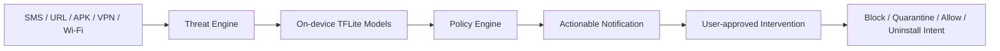

# CyberShield Android

CyberShield Android, cihaz uzerinde calisan TFLite tabanli moduler bir siber savunma uygulamasidir. Amaci SMS/metin, link, APK kurulumu, DNS/VPN ag trafigi ve Wi-Fi risk sinyallerinden gelen olaylari dusuk pil/RAM yukuyla analiz etmek; kullanici onayli mudahale akisiyla uyari, engelleme, karantina, guvenli sayma ve Android sistem kaldirma ekranina yonlendirme secenekleri sunmaktir.

Bu public README, urunun guvenli bir teknik ozetini verir. Model esikleri, ayrintili feature haritalari, saha kalibrasyon notlari ve operasyonel zayiflik analizleri public dokumanda tutulmaz.

## Temel Yetenekler

- Cihaz uzerinde offline TFLite inference.
- Olay bazli model yukleme ile dusuk kaynak kullanimi.
- Arka planda foreground servis ile surekli koruma.
- SMS/metin ve paylasilan linklerde sosyal muhendislik/phishing analizi.
- APK kurulum ve degisim olaylarinda zararlı yazilim risk analizi.
- VPN tabanli DNS, DoH ve ag akisi sinyallerinden tehdit tespiti.
- Wi-Fi baglanti guvenligi, MITM/ARP ve supheli ag davranisi risk takibi.
- Kullanici onayli mudahale ekrani: uyar, engelle, gecici engelle, karantinaya al, guvenli say, kaldirma ekranina git.
- Imzali online guvenlik guncellemeleri: threat intelligence feed, metadata, model ve politika paketleri.
- SHA-256 ve ECDSA dogrulamasi gecmeyen paketleri reddeden guvenli guncelleme mekanizmasi.
- Android platform sinirlarina uygun calisma: root/MDM olmadan sessiz uygulama silme veya router seviyesinde zorlayici islem yapmaz.

## Model Kapsami

CyberShield tek bir buyuk model yerine alan bazli bir model mimarisi kullanir:

- Android malware riski
- Android uygulama ag davranisi
- Mirai/IoT davranislari
- DNS ve DoH riskleri
- Network anomaly ve saldiri davranislari
- Phishing URL/HTML
- Sosyal muhendislik metinleri
- Wi-Fi MITM/ARP ve genis Wi-Fi tehditleri
- TLS/session ve post-kuantum anomali sinyalleri
- Honeypot/threat-intelligence destek sinyalleri
- Kullaniciya aciklama ve mudahale onerisi ureten policy/asistan katmani

Model performans degerleri veri seti ve test kosullarina baglidir. Public dokumanda esik, kolon sirasi ve zayiflik notlari paylasilmaz; saha kullanimi icin loglama, false-positive takibi ve kontrollu kalibrasyon gereklidir.

## Savunma Akisi



## Online Guvenlik Guncellemeleri

CyberShield modelleri telefonda rastgele yeniden egitmez. Guvenli mimari:

- Yeni tehdit verileri ve modeller kontrollu ortamda hazirlanir.
- Paketler imzalanir ve hash bilgisiyle yayinlanir.
- Android uygulamasi sadece HTTPS uzerinden indirir.
- SHA-256 ve ECDSA dogrulamasi basarisizsa paket aktif edilmez.
- Bozuk veya imzasiz paketlerde uygulama yerlesik guvenli varliklara geri doner.
- GitHub tarafinda guncellemeler protected environment ve pull request akisi ile denetlenir.

Detayli guncelleme guvenligi icin:

- `SECURITY.md`
- `docs/SECURITY_UPDATE_PIPELINE.md`
- `docs/GITHUB_HARDENING.md`

## Android Gercegi

CyberShield Android'in guvenlik modeline uyar:

- Kullanici onayi olmadan baska uygulamalari sessizce silemez.
- VPN korumasi icin Android VPN izni gerekir.
- Wi-Fi saldirganini modemden atamaz veya router firewall kurali yazamaz.
- Yikici veya hassas aksiyonlar kullanici onayi ile uygulanir.

## Derleme

```powershell
$env:JAVA_HOME='C:\Program Files\Android\Android Studio\jbr'
$env:Path="$env:JAVA_HOME\bin;$env:Path"
gradle assembleRelease
```

Release APK `app/build/outputs/apk/release/app-release.apk` altinda uretilir.
