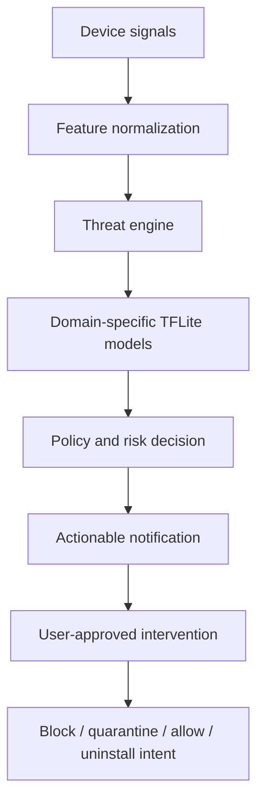

# CyberShield Public Defense Architecture

## Tasarim Hedefleri

CyberShield, manuel laboratuvar araci yerine arka planda calisan ve hassas aksiyonlarda kullanici onayi isteyen bir Android savunma uygulamasi olarak tasarlanmistir.

Oncelikler:

- Dusuk pil, RAM ve CPU kullanimi.
- Cihaz uzerinde offline TFLite inference.
- Olay bazli model calistirma.
- Bildirimden dogrudan mudahale ekranina gecis.
- Geri alinabilir engelleme, karantina ve guvenli sayma kararları.

## Kaynak Katmanlari

CyberShield asagidaki kaynaklardan sinyal alir:

- SMS ve metin icerikleri
- Paylasilan veya acilan linkler
- APK kurulum/degisim olaylari
- Android VPN uzerinden ag ve DNS sinyalleri
- Wi-Fi baglam ve baglanti guvenligi sinyalleri
- Threat-intelligence destek verileri

## Karar Akisi

## Politika ve Guvenlik

- Yikici islem kullanici onaysiz uygulanmaz.
- Kaldirma islemi Android sistem ekranina devredilir.
- Engelleme ve guvenli sayma kararlari geri alinabilir.
- VPN korumasi Android VPN iznine baglidir.
- Wi-Fi risklerinde uygulama telefonun erisebildigi Android sinyalleriyle calisir; router veya baska cihazlar uzerinde zorlayici islem yapmaz.
- DNS ve ag korumasi, kullanici tarafindan verilen izinler ve Android platform sinirlari icinde uygulanir.

## Public Dokuman Siniri

Bu public mimari dokumani sinif adlari, portlar, local socket ayrintilari, tam feature haritalari, model esikleri ve bypass'a yardimci olabilecek false-positive istisnalarini icermez. Bu bilgiler private operasyonel dokumanda tutulmalidir.
