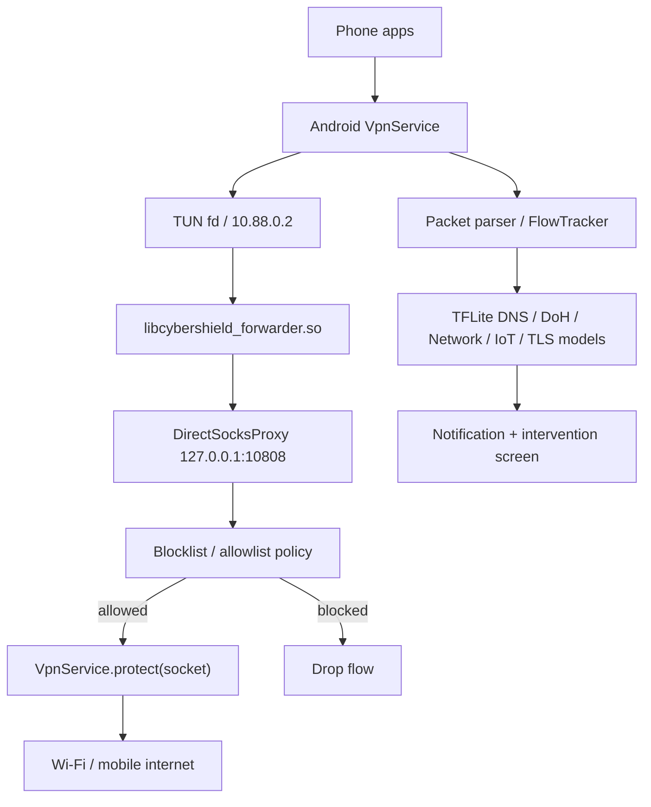

# CyberShield Defense Architecture

## Tasarim hedefleri

CyberShield, manuel laboratuvar araci olarak degil, arka planda otomatik calisan ve kritik aksiyonlarda kullanici onayi isteyen profesyonel bir savunma uygulamasi olarak tasarlanmistir.

Oncelikler:

- Dusuk pil, RAM ve CPU kullanimi.
- Offline TFLite inference.
- Kaynak bazli model calistirma.
- Bildirimden dogrudan mudahale ekranina gecis.
- Engelleme/karantina/guvenli sayma kararlarinin geri alinabilir olmasi.

## Kaynak baglayicilari

| Kaynak | Android bileseni | Model hattı |
| --- | --- | --- |
| SMS | `SmsThreatReceiver` | Social text, URL, phishing |
| Paylasilan link/metin | `LinkScanActivity` | Social URL, social text, phishing |
| APK kurulumu/degisimi | `PackageThreatReceiver` | Android malware |
| VPN paketleri | `DefenseVpnService` + native forwarder | DNS, DoH L1/L2, Network, IoT, TLS/PQC |
| Flow istatistikleri | `FlowTracker` | Network 79, IoT 71, anomaly/PQC |

## Karar akisi

1. Kaynak bileseni sinyali yakalar.
2. `FeatureExtractor` ve `FeatureSchema` modelin bekledigi boyutta feature uretir.
3. `ThreatEngine` ilgili TFLite modelini olay bazli yukler.
4. Model skoru `model_catalog.json` icindeki esik ve politika ile karsilastirilir.
5. Aksiyon gerekiyorsa `CyberDefenseService` mudahale bildirimi uretir.
6. Bildirime tiklaninca `InterventionActivity` olay detayina acilir.
7. Kullanici onayina gore blok, gecici blok, karantina, guvenli sayma veya kaldirma intent'i uygulanir.

## Politika ve guvenlik

- Destructive islem kullanici onaysiz uygulanmaz.
- Kaldirma islemi Android sistem uninstall ekranina devredilir.
- Blok/karantina hedefleri app storage icinde saklanir.
- Whitelist karari model uyarilarini bastirabilir.
- Son karar geri alinabilir.

## VPN durumu

Mevcut VPN servisinde:

- TUN arayuzu acilir.
- Native kutuphane varsa `0.0.0.0/0` tam cihaz rotasi acilir.
- `libcybershield_forwarder.so` TUN paketlerini kullanici-uzayi tun2socks motoruna alir.
- `DirectSocksProxy` temiz TCP/UDP akislarini internete iletir.
- Outbound soketler `VpnService.protect()` ile VPN dongusune sokulmaz.
- IPv4, TCP, UDP ve DNS paketleri parse edilir.
- DNS/DoH tespitleri modele verilir.
- Flow bazli paket/byte/sure/flag istatistikleri tutulur.
- Blok listeye dusen domain/IP/port hedefleri SOCKS koprusunde dusurulur.

Native motor yoksa veya baslatilamazsa:

- Uygulama tam rota acmaz.
- Guvenli telemetri rotalarina geri duser.
- Telefonun internetini bozmaz.
- Saha test ekraninda mod `safe_telemetry_routes` olarak gorunur.

Native motor basarili oldugunda saha test ekraninda mod `full_device_forwarding` olarak gorunur. Galaxy A56 testinde native kutuphane yuklendi, `tun0` aktif oldu ve TCP 443 baglanti testi basarili sonuc verdi. ICMP/ping tun2socks tarafindan tasinmadigi icin desteklenmez.
